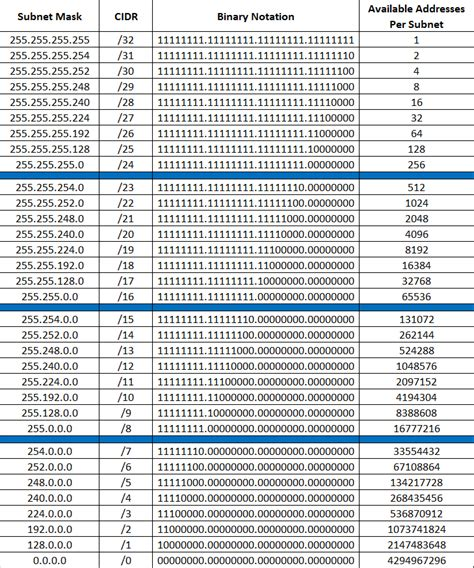

# Tugas-2-Jarkom-docs

Docs about my CIDR implementation from class assignment.

Two big steps on making this works (= machine from any subnet can ping machines from other subnet):
- Subnetting
- CPT setup
  - Assigning IP addresses
  - Picking the right transmission medium
  - Routing packets

## Subnetting

It was stated that there will be main and branch office area. This means there is an additional subnet for routers that connects the previously stated two area. The smallest unit of subnet is by a LAN formed under one room from the office area (eg. subnet A6 consisting of 6 hosts in Server & Admin room). Put these into consideration before doing CIDR subnet calculation. 

I will now give you one example of CIDR subnet calculation. Say there is 95 host in one of the main office room. We will now call it subnet "A1". 

1. First, find the closest subnet mask that has more available addresses than the amount of host the room has. If there is a demand for 62142 hosts, then you should pick subnet /16 with room for 65536 hosts (look at subnet table above). Any subnet with  higher availability would be considered as a waste. In this case, picking /25 should suffice since it has room for 128 hosts while the need is 95, sufficient but not too much.
2. Then pick the starting network address of this subnet (very important to remember for routing later).
3. Note its 1st, last usable addr, and broadcast address: 
- Mentioned by multiple guides, broadcast address's 4th octet is always odd numbered while last usable addr's 4th octet is always even.
- Broadcast address's 4th octet is 127 not 128 because the address counts from 0.

| Alias  | Hosts | Subnet Mask      | Incerment  | Network addr  |  Sub. Mask  | 1st usable addr.  | Last usable addr.  | Broadcast addr.  |
| ------ | ----- | ---------------- | ---------- | ------------- | ----------- | ----------------- | ------------------ | ---------------- |
| A1     | 95    | 255.255.255.128  | 128        | 10.31.0.0     | /25         | 10.31.0.1         | 10.31.0.126        | 10.31.0.127      |
| A2     | 45    | 255.255.255.128  | 64         | 10.31.0.128   | /26         | 10.31.0.129       | 10.31.0.190        | 10.31.0.191      |
| ..     | ..    | ..               | ..         | ..            | ..          | ..                | ..                 | ..               |

One of the room on main office area has over 380 hosts. Choosing to use subnet /23 is doable but we could save more room by sticking the changes only to 4th octet. To do that I divided the room into two subnet instead of the previous "one room = one subnet". With this, it will use 384 address instead of 512.

## CPT Setup: Assigning IP addresses

If it connects to anything, then it should has an IP address. Unless if its a layer 2 device like switches. Make sure that every connected router and endpoint devices has an IP address. 

For endpoint devices, make sure it has:
- the correct netmask as the gateway devie.
- the correct gateway addr as the one it connects to.
- an IP address that is within the netmask's boundaries.
